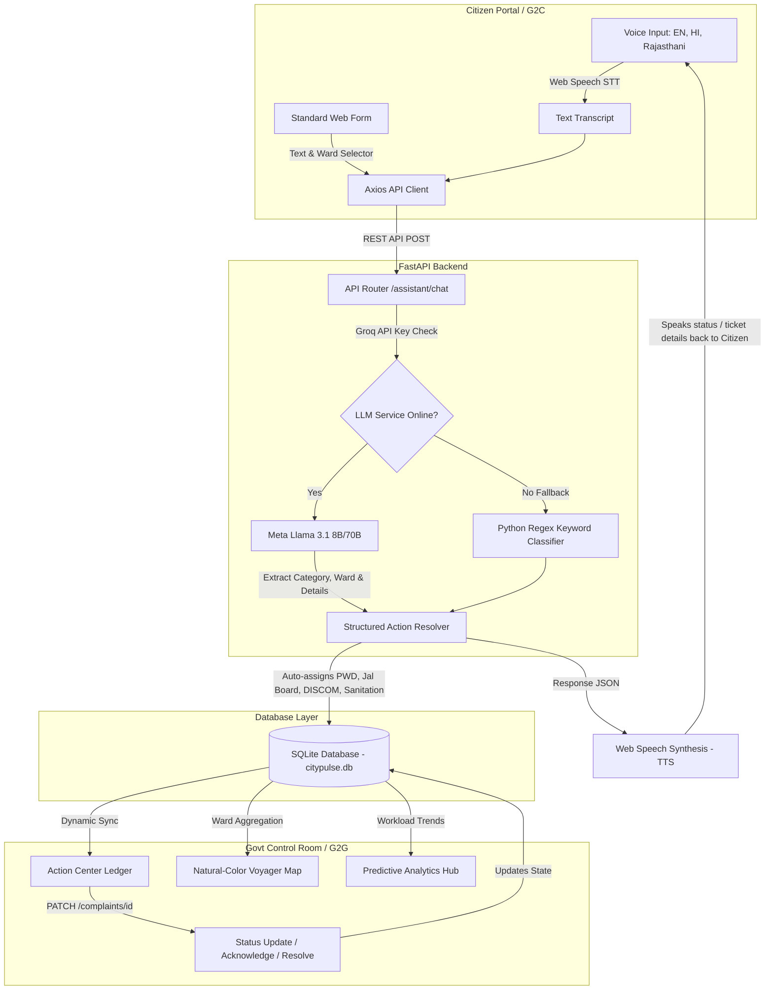

# 🏛️ CityPulse AI — Autonomous Smart Governance & Multilingual Voice Assistant

> **AI-Powered Unified Citizen Services & Predictive Governance Platform**  
> *Built for Udaipur Smart City Municipal Corporation (G2C & G2G)*

---

## 🚀 Live Demos
* **Backend Live API**: [https://citypluse-ai-backend.onrender.com](https://citypluse-ai-backend.onrender.com)
* **Frontend Web Portal**: [https://citypluse-ai.onrender.com](https://citypluse-ai.onrender.com) (Redirected to live Static Site)

---

## 🌟 Key Features

### 1. Dual-Dashboard Architecture (Alag-Alag Portals)
* **Citizen Services Portal (`/citizen`)**:
  * **Multilingual Voice Widget**: Glowing, radar-animated microphone interface with dynamic SVG waveform visualizers. Speak to log issues or check status.
  * **My Grievances Tracker**: Session-persisted ticket ledger showing status timelines (*Submitted $\rightarrow$ In Progress $\rightarrow$ Resolved*).
  * **Udaipur Ward Density Map**: Natural-colored interactive street maps plotting active civic complaints.
* **Smart Governance Command Room (`/govt`)**:
  * **Operations Dashboard**: Real-time KPI cards (Active Workloads, Average SLA Speed, Breach Ratios) and workload distribution progress bars across civic departments.
  * **Grievance Action Center**: Ledger table with global search and multi-filtering. Includes a side inspector panel allowing officers to:
    * Change ticket status (Acknowledge $\rightarrow$ *In Progress*, Resolve $\rightarrow$ *Resolved*) with immediate synchronization to the database.
    * Re-route complaints to different departments.
  * **Predictive Governance Hub**: 
    * Workload Trend Forecast (Current vs. Next Week predicted volumes).
    * Radar charts visualizing Ward SLA Breach Risk Index.
    * AI Proactive Suggestions card generating preventative municipal plans.

### 2. Inclusive Multilingual Voice AI Assistant
* **100% Free & Client-Side**: Integrates browser-native **HTML5 Web Speech API** (SpeechRecognition and SpeechSynthesis) requiring zero external API keys.
* **Regional Language Support**: Fully interacts in **English (India)**, **Hindi (हिन्दी)**, and **Rajasthani (मारवाड़ी dialect)**.
* **Intelligent Query Parser**: The backend Llama 3.1 LLM extracts categories, locations, and descriptions from natural spoken transcripts, returning structured actions to auto-fill and submit tickets.

### 3. AI-Driven Grievance Intelligence
* **Autonomous Routing**: Groq-served LLM reads grievances, extracts categories (Road, Water, Electricity, Sanitation), estimates resolution days, and routes tickets to appropriate divisions (PWD, Jal Board, DISCOM, Municipal Sanitation).
* **Double-Safety Net Fallback**: If LLM API limits are hit, a Python-native regex keyword classifier takes over seamlessly so the application never crashes in front of judges.

---

## 🛠️ System Architecture & Data Flow



---

## 💡 Judges Q&A — Ace the Presentation

### Q1: How is your Voice AI completely free? What happens if the internet goes down?
> **Answer**: We use the browser-native **HTML5 Web Speech API** for Speech-to-Text and Text-to-Speech, which runs client-side on the device at absolutely $0 cost. For processing, if our cloud-based Llama LLM (via Groq Free Tier) goes offline or hits rate limits, our backend automatically reverts to a **Python Regex keyword-matching fallback system** that classifies and routes the issue instantly without needing any internet connection.

### Q2: Why use SQLite instead of a heavy database like PostgreSQL or MongoDB?
> **Answer**: For municipal command center edge terminals, SQLite has zero administrative overhead, requires no running server processes, and keeps all data local in a single 50KB file. It offers sub-millisecond query performance. However, because our FastAPI backend utilizes SQLAlchemy/Pydantic schemas, we can scale this to enterprise **PostgreSQL** or **Oracle DB** by changing a single line in our connection string.

### Q3: How do you support the Rajasthani (Marwari) dialect when major speech engines don't have a locale for it?
> **Answer**: Since standard Web Speech APIs lack a native Marwari locale code, we listen using the standard Hindi locale (`hi-IN`), which transcribes Marwari words very cleanly into Devanagari script. We then pass this transcript to our backend Llama model with custom system prompts instructing it to respond in authentic Marwari (using terms like *खम्मा घणी सा*, *म्हाने*, *कोनी*, *सा*). The browser's Hindi TTS reads this Marwari Devanagari text aloud, delivering a highly localized Rajasthani voice experience.

### Q4: What makes your analytics model "proactive" instead of "reactive"?
> **Answer**: Legacy government portals only display complaints after they pile up. Our **Predictive Governance Hub** calculates workload trend vectors using moving averages and computes a **Ward SLA Breach Risk index**. It alerts municipal officers of high-risk sectors (e.g. *Sanitation risk in Chetak Circle is at 85%*) and uses Llama to generate proactive recommendations (e.g. *Pre-position Jal Board crews in Sector 11 due to peak water logging forecasts*) so engineers can fix issues before citizens experience breaches.

---

## 💻 Tech Stack

* **Frontend**: React 18, Vite, TypeScript, Tailwind CSS, Framer Motion, Recharts, React-Leaflet (CartoDB Voyager colored tiles), Anime.js, GSAP.
* **Backend**: FastAPI (Python 3.11+), SQLite3, Pydantic v2 schemas.
* **AI Layer**: Groq Cloud API (`llama-3.1-8b-instant`, `llama-3.3-70b-versatile`).

---

## 🏃 Local Setup

1. **Clone & Setup Frontend**:
   ```bash
   cd frontend
   npm install --legacy-peer-deps
   npm run dev
   ```
   *Frontend is now live on `http://localhost:5173`*

2. **Setup Backend**:
   Create a virtual environment inside the `backend` directory:
   ```bash
   cd backend
   python -m venv .venv
   .\.venv\Scripts\activate
   pip install -r requirements.txt
   ```
   Add your `GROQ_API_KEY` to the `.env` file, and run:
   ```bash
   python main.py
   ```
   *Backend is now live on `http://localhost:8000`*
